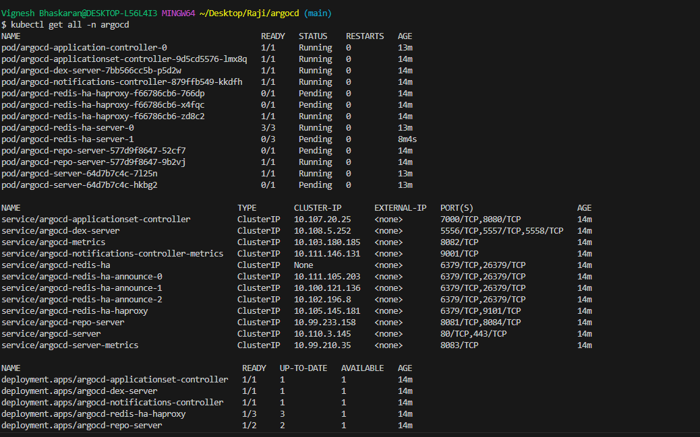
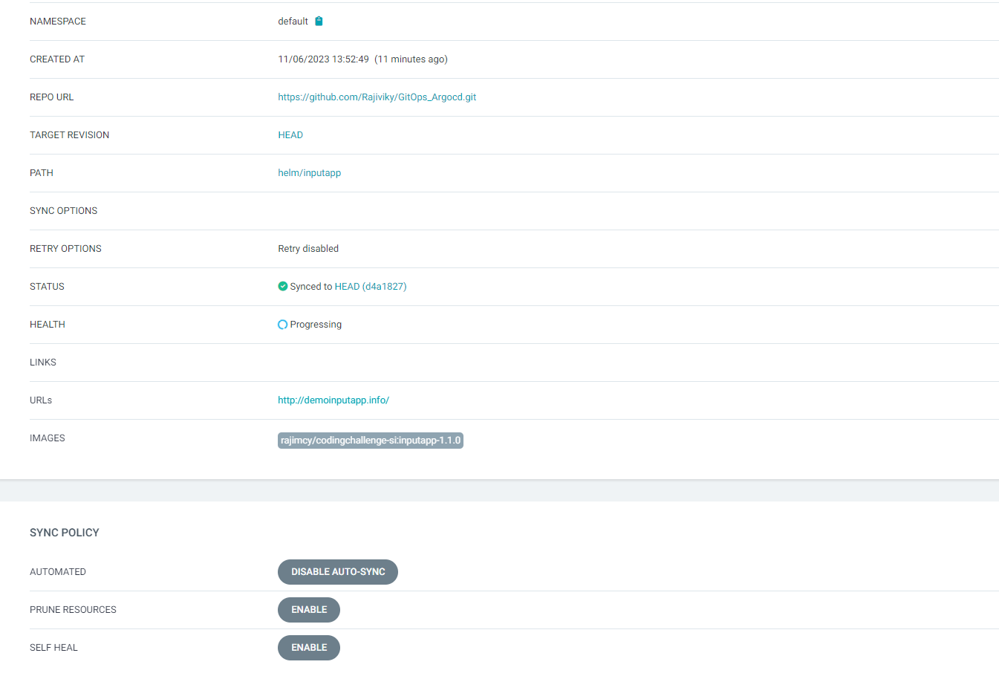
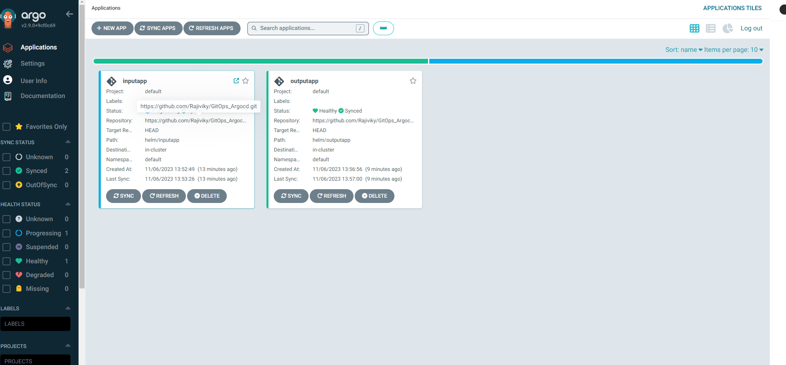

### Auto-deployment in minikube with Argocd

## Installing ArgoCD on minikube: ( Minikube is already installed in my laotop and start using docker driver)

Step 1: minikube start 

Step 2: kubectl create ns argocd (ArgoCD requires a namespace with its name. Therefore, we will create a namespace for argocd)

Step 3: Apply ArgoCD manifest installation file from ArgoCD github repository
           kubectl apply -n argocd -f https://raw.githubusercontent.com/argoproj/argo-cd/v2.9.0/manifests/ha/install.yaml ( get the desired version from argocd repo)

Step 4: verify the installation by getting all the objects in the ArgoCD namespace.
         kubectl get all -n argocd

         

we should see all the resources created with the installation. Some resources may need some time to be in a running state but having them there means that we are good to go.

## Argocd user Interface:

In order to access the web GUI of ArgoCD, we need to do a port forwarding. For that we will use the argocd-server service (But make sure that pods are in a running state before running this command)

    kubectl port-forward svc/argocd-server -n argocd 8080:443
 Once done, we can access Argocd user inerface from browser with localhost:8080

 To use ArgoCD interface, we need to enter our credentials. The default username is admin so we can enter it immediately, but we will need to get the initial password from ArgoCD through minikube terminal.

Initial password is kept as a secret in the argocd namespace; therefore, we will use jsonpath query to retrieve the secret from the argocd namespace. We also need to decode it with base64. To do the both operations, just open a new terminal and enter the following code to do the trick for you. (Do not close the first terminal window as the port-forwarding is still alive)
   kubectl -n argocd get secret argocd-initial-admin-secret -o jsonpath="{.data.password}" | base64 -d; echo

Copy the password from the above command output and use it on the browser with username: admin

## Deploying input app and output app:

Now that we are in the user interface, we can create a new app. The source code for my application is in my Github repo, so I will connect my Github repo to ArgoCD

1. Click on the gear icon to open settings
2. Click on repositories
3. Click on connect repo
4. For connection method, choose HTTPS, for Project choose default, and enter your github repo as repository URL. Finally, hit on connect.
5. You should get a Successful message in terms of connection status.
6. Let’s create a new app from the repo. At the far right of the Successful message, click on the three dots. The pop up menu will have a create applicationoption. Also click that option.
7. Enter test as application name, choose default for Project Name, and choose Automatic for Sync Policy.
8. Enter repository URL (You do not have to type it down, it is already there) Enter your manifest path as path (My resource files are in helm/ directory of my repo). I chose helm/inputapp for inputapp and helm/outputapp for outapp application. If you have helm charts in separate repository in tge step 2 choose helm instead of tyep: git and provide your helm repo details.

ArgoCD automatically detects that in the path you specified, the application has to be onboarded as a Helm chart not via Kubernetes Manifest files. It understands that type by scanning Chart.yaml in the path you specified to detect the Kind of Application. In my case chart.yaml is inside charts/podinfo of the repository. You can read more about automated tool detection here.

9. Choose kubernetes.default.svc as cluster URL. Use the namespace which you have created for the application. Hit on Create on the top

There we go! We have our app!

